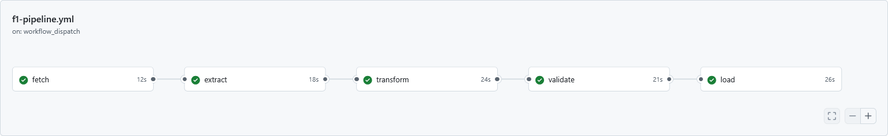

# F1 ETL Pipeline

[](https://github.com/jmr-lab/f1-etl-pipeline/actions)

An ETL pipeline that scrapes Wikipedia for F1 data and transforms it into an analytics-ready dataset for Formula 1 analytics and driver GOAT analysis.

## Overview

This pipeline currently scrapes some data from Wikipedia, with the remaining tables sourced from the [Ergast F1 API dataset](https://relational.fel.cvut.cz/dataset/ErgastF1). Future releases will migrate all data sources to Wikipedia for better currency. It then validates data quality, applies transformations, and outputs a unified `formula1.csv` file. The cleaned dataset feeds the companion [Formula-1 Analytics](https://github.com/jmr-lab/Formula-1) R project for exploratory analysis and GOAT modelling.

## Pipeline Architecture

```
┌─────────────┐    ┌──────────┐    ┌─────────────┐    ┌────────────┐    ┌──────────┐
│ Scrape Wiki │ →  │ Extract  │ →  │  Transform  │ →  │  Validate  │ →  │   Load   │
└─────────────┘    └──────────┘    └─────────────┘    └────────────┘    └──────────┘
       ↓                 ↓                 ↓                 ↓                ↓
 Wikipedia          Raw CSVs        Unified schema     Quality checks    CSV + SQL + DB
```

## Workflow Execution
   
Here's an example of the pipeline running successfully:
   

   
*Execution times may vary depending on runner configuration.*
   
## Features

- **Scrape**: Fetches fresh F1 data from Wikipedia (with graceful degradation if scraping fails)
- **Extract**: Loads 10+ CSV tables from the Ergast F1 dataset with encoding resilience
- **Transform**: Normalises schemas, merges relationships, calculates derived fields (driver age, cumulative points, image paths)
- **Validate**: 3 automated quality checks (year range, race winners, status-points consistency)
- **Load**: Exports CSV, MariaDB-compatible SQL, and SQLite database formats

## Automation

The pipeline runs automatically via [GitHub Actions](https://github.com/features/actions). The workflow definition is available at [.github/workflows/f1-pipeline.yml](https://github.com/jmr-lab/f1-etl-pipeline/blob/main/.github/workflows/f1-pipeline.yml) and can be reused or adapted if you want to run this pipeline on your own fork.

### How It Works

| Stage | Job | Description |
| ----- | --- | ----------- |
| 1 | `scrape` | Scrapes Wikipedia for fresh F1 data (optional; pipeline continues if scrape fails) |
| 2 | `extract` | Loads the raw CSV files from `data/raw/` and uploads them as a workflow artifact |
| 3 | `transform` | Builds the unified `formula1` dataset and passes it to the next stage |
| 4 | `validate` | Runs the data quality checks; the workflow fails if any check fails |
| 5 | `load` | Generates `data/processed/formula1.csv`, `sql/formula1.sql` and `sql/formula1.db`, then commits them to the repository |

The `scrape` job uploads raw CSVs as artifacts; intermediate datasets (`.pkl` files) are passed between remaining jobs as GitHub Actions artifacts and are not stored in the repository.

### Triggers

The workflow runs:

- **Automatically** on push, when files under `data/raw/` change or when `src/scrape.py` is modified
- **Manually** via the [Run workflow](https://docs.github.com/en/actions/managing-workflow-runs/manually-running-a-workflow) button in the Actions tab

### Running It Yourself

If you fork this repository:

1. Place the Ergast F1 CSV files in the `data/raw/` folder
2. Trigger the workflow (push a change or use manual dispatch)
3. The validated outputs will be committed to `data/processed/` and `sql/` once the pipeline completes

You can also run the pipeline locally without GitHub Actions:

```bash
python run_pipeline.py
```

## Installation

Clone this repository and ensure Python 3.11+ is installed:

```bash
git clone https://github.com/jmr-lab/f1-etl-pipeline.git
cd f1-etl-pipeline
pip install pandas
```

## Usage

For development, testing, or offline work:

```bash
python run_pipeline.py
```

## Directory Structure

```
f1-etl-pipeline/
├── src/
│   ├── extract.py
│   ├── transform.py
│   ├── validate.py
│   ├── load.py
│   └── resources/           ← Custom lookup tables
├── data/
│   ├── raw/                 ← Place Ergast CSV files here
│   └── processed/           ← Generated formula1.csv
├── sql/                     ← Generated formula1.sql and formula1.db
├── run_pipeline.py
└── README.md
```

## Outputs

| File                     | Description                      |
| ------------------------ | -------------------------------- |
| `data/processed/formula1.csv`    | Analytics-ready dataset                          |
| `sql/formula1.sql`               | MariaDB import script                            |
| `sql/formula1.db`                | SQLite database with indexed formula1 table      |

## Sample Data

Below is an extract from the output dataset showing a subset of rows and columns (not all data displayed for readability). This excerpt covers the opening races from the 1950 British Grand Prix (the first Formula 1 World Championship race):

| year | round | circuit | status | laps | driverName | constructorName | positionOrder | points |
| ---- | ----- | ------- | ------ | ---- | ---------- | --------------- | ------------- | ------ |
| 1950 | 1 | British Grand Prix | Finished | 70 |  Nino Farina |  Alfa Romeo | 1 | 9 |
| 1950 | 1 | British Grand Prix | Finished | 70 |  Luigi Fagioli |  Alfa Romeo | 2 | 6 |
| 1950 | 1 | British Grand Prix | Finished | 70 |  Reg Parnell |  Alfa Romeo | 3 | 4 |
| 1950 | 1 | British Grand Prix | Lapsed | 68 |  Yves Cabantous |  Talbot-Lago | 4 | 3 |
| 1950 | 1 | British Grand Prix | Lapsed | 68 |  Louis Rosier |  Talbot-Lago | 5 | 2 |
| 1950 | 1 | British Grand Prix | Lapsed | 67 |  Bob Gerard |  ERA | 6 | 0 |

*Full dataset contains 27,238 rows spanning from 1950 to the current year minus one.*

## Data Schema

The `formula1.csv` file contains the following columns:

| Column                 | Type            | Description                                |
| ---------------------- | --------------- | ------------------------------------------ |
| `resultId`             | INT             | Unique result identifier                   |
| `grid`                 | INT             | Starting grid position                     |
| `positionOrder`        | INT             | Finishing position order                   |
| `cumulPoints`          | DOUBLE          | Cumulative driver points at race           |
| `points`               | DOUBLE          | Points awarded for the race                |
| `year`                 | INT             | Season year                                |
| `round`                | INT             | Round number within season                 |
| `circuit`              | VARCHAR(255)    | Circuit name                               |
| `driverName`           | VARCHAR(255)    | Full driver name                           |
| `driverAge`            | INT             | Driver age in years at race date           |
| `constructorName`      | VARCHAR(255)    | Team name                                  |
| `driverCountry`        | VARCHAR(100)    | Driver's country of origin                 |
| `constructorCountry`   | VARCHAR(100)    | Constructor's country of origin            |
| `driverImage`          | VARCHAR(255)    | Path to flag icon                          |
| `constructorImage`     | VARCHAR(255)    | Path to flag icon                          |

The SQLite database additionally includes two indexes optimised for common queries:
- idx_formula1_race on (year, round) — fast per-race lookups
- idx_formula1_driver on (driverName) — fast per-driver lookups

## Technologies

- Python 3.11+
- pandas (>= 2.0)
- SQLite (via the built-in sqlite3 module)
- No external API calls (offline CSV processing)

## Related Projects

| Project               | Language         | Purpose                              |
| --------------------- | ---------------- | ------------------------------------ |
| Formula-1 Analytics   | R (tidyverse)    | EDA, visualisations, GOAT modelling  |

## Why Two Languages?

Separating ETL from analysis brings practical benefits:
- **Python** excels at robust data pipelines and batch processing
- **R** provides richer statistical modelling and visualisation capabilities (tidyverse, ggplot2)

Analysts can focus on insights in R while trusting the Python pipeline delivers clean, validated data.

## Validation Scope

The validation performed by this pipeline is intentionally basic. It checks a small number of high-level data-quality rules rather than attempting to enforce every possible Formula 1 racing constraint.

For example, the pipeline checks that each race has at least one winner. Although a stricter rule could require exactly one winner, an analysis of the dataset found three races with two winners, so enforcing that constraint would incorrectly reject valid historical data.

The pipeline also checks that drivers marked as `Not Qualified` or `Not Classified` have zero points. It does not currently enforce a zero-point rule for disqualified drivers. The dataset includes at least one historical exception: Stirling Moss was disqualified but received one point for recording the fastest lap.

These exceptions, along with the broader characteristics of the dataset, were identified through analysis in the companion [Formula-1 Analytics](https://github.com/jmr-lab/Formula-1) repository. The validation rules should therefore be understood as pragmatic consistency checks rather than a complete representation of Formula 1 sporting regulations.

## Validation Checks

The pipeline enforces these basic data-quality rules:

1. **Year Range**: All races must be between 1950 and the current year.
2. **Race Winners**: Every race (year, round combination) must have at least one winner. The pipeline does not require exactly one winner because the dataset contains three races with two winners.
3. **Status-Points Consistency**: Drivers marked `Not Qualified` or `Not Classified` must have 0 points. Disqualified drivers are not covered by this validation rule.
